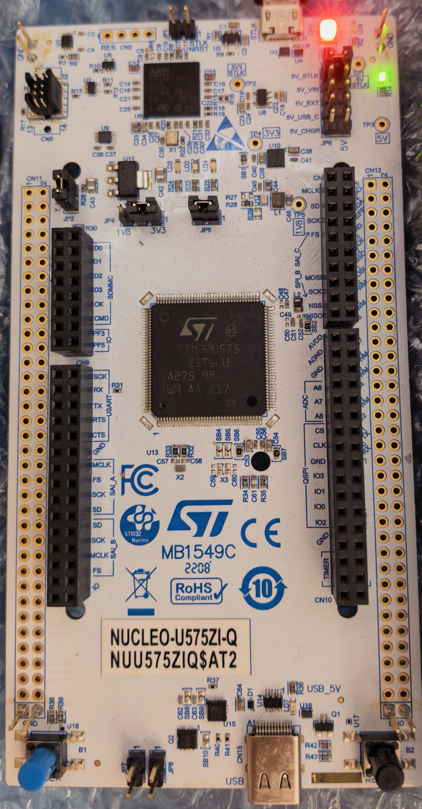
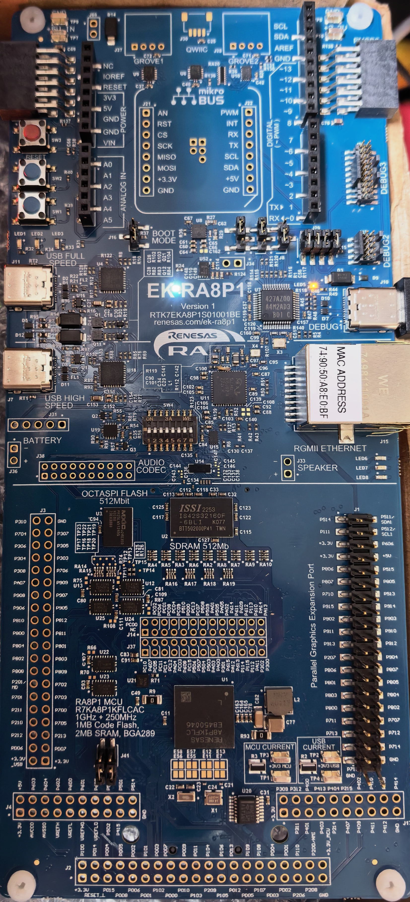

# RTT Assistant

## 介绍
- **RTT Assistant**是一个功能丰富的RTT(Real Time Transfer)调试工具，通过J-Link或DAP-Link/ST-Link等调试器与MCU进行RTT通信。
- **RTT Assistant对标Segger**的相关产品，主要**扩展多种调试**支持和**人性化功能**的支持。
- 目前测试和验证了3种调试器：**J-Link、DAP-Link、ST-Link**。
  
<div style="display: flex; justify-content: center;">
    
</div>

<div style="display: flex; gap: 5%; justify-content: center; align-items: center; width: 100%;">
    
    
    
</div>


## 快速开始

1. 双击 `RTT-Assistant vx.x.x.exe` 启动
2. 点击"配置"按钮
3. 点击"刷新"选择探针类型（J-Link / DAP-Link / ST-Link）
4. 选择目标芯片，配置接口和速度(列表没有则点击“Pack”按钮，输入型号自动下载，也可以手动下载)
5. 选择RTT控制块模式(3选1)
6. 点击"连接"按钮，开始收发RTT数据

## 与 SEGGER RTT 工具对比

| 功能 | RTT Assistant | J-Link RTT Viewer | JLinkRTTClient | JLinkRTTLogger | J-Scope |
|------|:---:|:---:|:---:|:---:|:---:|
| **免费开源** | ✅ GPLv3 | ❌ 专有 | ❌ 专有 | ❌ 专有 | ❌ 专有 |
| **J-Link 探针** | ✅ | ✅ | ✅ | ✅ | ✅ |
| **DAP-Link / ST-Link** | ✅ | ❌ | ❌ | ❌ | ❌ |
| **图形化界面** | ✅ | ✅ | ❌ CLI | ❌ CLI | ✅ |
| **多通道显示** | ✅ | ✅ | ❌ | ❌ | ❌ |
| **实时波形/示波器** | ✅ 内置 | ❌ | ❌ | ❌ | ✅ 免费工具 |
| **ANSI 颜色解析** | ✅ | ❌ 有限 | ✅ | ❌ | ❌ |
| **关键字高亮** | ✅ 自定义 | ❌ | ❌ | ❌ | ❌ |
| **HEX 显示** | ✅ | ❌ | ❌ | ❌ | ❌ |
| **时间戳** | ✅ | ✅ | ❌ | ❌ | ❌ |
| **CMSIS Pack 管理** | ✅ 自动加载 | ❌ | ❌ | ❌ | ❌ |
| **MAP 文件符号搜索** | ✅ | ❌ | ❌ | ❌ | ❌ |
| **RTT 控制块范围搜索** | ✅ | ✅ | ❌ | ❌ | ❌ |
| **数据导出** | ✅ | ✅ | ❌ | ✅ 文件日志 | ✅ |
| **配置文件保存** | ✅ | ❌ | ❌ | ❌ | ❌ |
| **多探针支持** | ✅ J-Link/DAP/ST-Link | ❌ 仅J-Link | ❌ 仅J-Link | ❌ 仅J-Link | ❌ 仅J-Link |

## 示波器模式使用说明

### 切换到示波器模式

点击工具栏的"示波器"按钮切换显示模式。

### 采集控制

1. 连接设备后，点击示波器工具栏的**"开始"**按钮启动采集
2. 点击**"暂停"**冻结画面（后台继续接收数据），再次点击**"恢复"**继续显示
3. 点击**"停止"**停止采集并清空画布

### 数据格式规则

示波器模式遵循 **JScope 标准格式规范**。**MCU 端负责**按规则声明和发送数据，RTT Assistant 自动检测并展示，无需手动选择格式。

格式通过 **RTT 通道名**声明（对应 SEGGER RTT 的 `acName` 字段）。连接成功后，RTT Assistant 自动读取通道名，解析其中的格式描述并显示在工具栏。

#### 通道命名规则

RTT 上行通道名必须以 `JScope_` 开头，后跟字段描述符：

```
JScope_<field1><field2>...
```

每个字段描述符由 **类型字母 + 字节数** 组成：

| 描述符 | 类型 | 大小 |
|--------|------|------|
| `t4` | 时间戳 (µs) | 4 字节 |
| `i1` | int8 | 1 字节 |
| `i2` | int16 | 2 字节 |
| `i4` | int32 | 4 字节 |
| `u1` | uint8 | 1 字节 |
| `u2` | uint16 | 2 字节 |
| `u4` | uint32 | 4 字节 |

#### 示例

##### 日志模式（通道 0）

通道 0 由 SEGGER RTT 默认初始化，无需额外配置，直接发送即可：

```c
#include "SEGGER_RTT.h"

// 通道 0 默认可用，直接发送文本
SEGGER_RTT_WriteString(0, "Hello RTT Assistant!\r\n");

// 格式化输出
SEGGER_RTT_printf(0, "温度: %d°C, 湿度: %d%%\r\n", temp, humidity);
```

##### 示波器模式（通道 1）

示波器模式使用 **JScope 标准格式**：MCU 端在通道名中声明数据结构，RTT Assistant 自动解析并展示。

需先通过 `SEGGER_RTT_ConfigUpBuffer()` 配置通道名，然后按声明格式发送二进制数据包：

```c
#include "SEGGER_RTT.h"

// 步骤1：配置通道1，通道名声明 JScope 数据格式
// 格式描述：t4(时间戳) + i4(int32) + u1(uint8)，共 9 字节/包
SEGGER_RTT_ConfigUpBuffer(1, "JScope_t4i4u1", NULL, 0, SEGGER_RTT_MODE_NO_BLOCK_SKIP);

// 步骤2：按声明格式发送数据包
void send_data(int32_t value, uint8_t status) {
    uint8_t packet[9];
    uint32_t ts = SEGGER_RTT_GetUpBufferFree(); // 或其他时间源

    *(uint32_t*)&packet[0] = ts;      // t4: 时间戳 (4字节)
    *(int32_t*)&packet[4]  = value;   // i4: int32   (4字节)
    packet[8] = status;               // u1: uint8   (1字节)

    SEGGER_RTT_Write(1, packet, 9);
}
```

#### 自动识别（无 JScope 命名）

如果通道名不以 `JScope_` 开头，则使用 **自动识别模式**：

每个数据值前加 1 字节类型标识：

| type_byte | 类型 |
|-----------|------|
| 0x01 | int8 |
| 0x02 | uint8 |
| 0x03 | int16 |
| 0x04 | uint16 |
| 0x05 | int32 |
| 0x06 | uint32 |
| 0x07 | float |

```c
// 自动识别模式：每个值前加 type_byte
uint8_t buf[5];
buf[0] = 0x07;  // float
memcpy(&buf[1], &val, 4);
SEGGER_RTT_Write(1, buf, 5);
```

## 系统要求

- Windows 10/11（64位）
- J-Link DAP-Link/ST-Link 驱动
- MCU需已移植SEGGER RTT代码并初始化

## 目录结构（打包后）

```
RTT-Assistant v2.1.0/
├── RTT-Assistant v2.1.0.exe   # 主程序
├── config/                     # 配置文件
│   └── config.json
├── runtime/
│   ├── dll/                    # 动态链接库
│   │   ├── JLink_x64.dll
│   │   └── libusb-1.0.dll
│   ├── packs/                  # CMSIS Pack文件
│   └── venv/                   # Python虚拟环境（PyOCD等依赖）
├── doc/                        # 文档
├── resources/                  # 资源文件
└── log/                        # 日志（自动创建）
    ├── rtt_system.log          # 系统日志（5MB轮转）
    ├── pyocd_diag.log          # PyOCD诊断日志（5MB轮转）
    └── rttdata_*.log           # RTT数据日志
```

## 源码开发

```bash
python main.py
```

### 打包

```bash
python build.py
```

输出: `dist/RTT-Assistant vx.x.x/`

## 许可证

GNU General Public License v3.0 (GPL v3)

## 作者

陈卡卡
