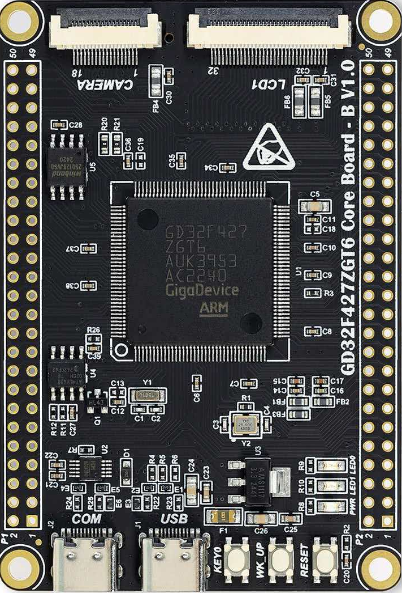

**English | [简体中文](README.md)**
# RTT Assistant

## Introduction
- **RTT Assistant** is a feature-rich RTT (Real Time Transfer) debugging tool that communicates with MCUs via debug probes such as J-Link, DAP-Link, or ST-Link.
- **RTT Assistant** benchmarks against SEGGER's related products, primarily **extending support for multiple debug probes** and **user-friendly features**.
- Currently tested and verified with 3 types of debug probes: **J-Link, DAP-Link, ST-Link**.**RA8P1、STM32U575、GD32F427**
  
<div style="display: flex; justify-content: center;">
    
</div>

<div style="display: flex; gap: 5%; justify-content: center; align-items: center; flex-wrap: wrap; width: 100%;">
    
    
    
    
</div>


## Quick Start

1. Double-click `RTT-Assistant vx.x.x.exe` to launch
2. Click the "Configure" button
3. Click "Refresh" and select the probe type (J-Link / DAP-Link / ST-Link)
4. Select the target chip, configure interface and speed
5. Select RTT control block mode (choose 1 of 3)
6. Click the "Connect" button to start sending and receiving RTT data

### CMSIS Pack Auto Download

When the target chip list does not contain the desired model, click the **"Pack"** button:

1. Enter the chip model (e.g., `STM32U575`, `R7FA6M5AF`, `GD32F407`)
2. The program automatically downloads the corresponding .pack file from the CMSIS Pack server to `runtime/packs/`
3. The download dialog shows the download link (selectable for copying), progress, and file size
4. After download completes, the target list is automatically refreshed

**Manual Download**: If automatic download fails (network issues, etc.), you can manually download the .pack file and copy it to the `runtime/packs/` directory, then click "Update" to refresh

## Comparison with SEGGER RTT Tools

| Feature | RTT Assistant | J-Link RTT Viewer | JLinkRTTClient | JLinkRTTLogger | J-Scope |
|------|:---:|:---:|:---:|:---:|:---:|
| **Free & Open Source** | ✅ GPLv3 | ❌ Proprietary | ❌ Proprietary | ❌ Proprietary | ❌ Proprietary |
| **J-Link Probe** | ✅ | ✅ | ✅ | ✅ | ✅ |
| **DAP-Link / ST-Link** | ✅ | ❌ | ❌ | ❌ | ❌ |
| **Graphical UI** | ✅ | ✅ | ❌ CLI | ❌ CLI | ✅ |
| **Multi-Channel Display** | ✅ | ✅ | ❌ | ❌ | ❌ |
| **Real-Time Waveform/Oscilloscope** | ✅ Built-in | ❌ | ❌ | ❌ | ✅ Free tool |
| **ANSI Color Parsing** | ✅ | ❌ Limited | ✅ | ❌ | ❌ |
| **Keyword Highlighting** | ✅ Custom | ❌ | ❌ | ❌ | ❌ |
| **Smart Scroll Tracking** | ✅ | ❌ | ❌ | ❌ | ❌ |
| **Diagnostic Log Management** | ✅ | ❌ | ❌ | ❌ | ❌ |
| **HEX Display** | ✅ | ❌ | ❌ | ❌ | ❌ |
| **Timestamp** | ✅ | ✅ | ❌ | ❌ | ❌ |
| **CMSIS Pack Management** | ✅ Auto download | ❌ | ❌ | ❌ | ❌ |
| **MAP File Symbol Search** | ✅ | ❌ | ❌ | ❌ | ❌ |
| **RTT Control Block Range Search** | ✅ | ✅ | ❌ | ❌ | ❌ |
| **Data Export** | ✅ | ✅ | ❌ | ✅ File log | ✅ |
| **Config File Save** | ✅ | ❌ | ❌ | ❌ | ❌ |
| **Multi-Probe Support** | ✅ J-Link/DAP/ST-Link | ❌ J-Link only | ❌ J-Link only | ❌ J-Link only | ❌ J-Link only |
| **Firmware Flashing** | ✅ J-Link/DAP/ST-Link | ❌ | ❌ | ❌ | ❌ |
| **i18n (ZH/EN)** | ✅ | ❌ | ❌ | ❌ | ❌ |

## Oscilloscope Mode Usage

### Switch to Oscilloscope Mode

Click the "Oscilloscope" button on the toolbar to switch the display mode.

### Acquisition Control

1. After connecting the device, click the **"Start"** button on the oscilloscope toolbar to begin acquisition
2. Click **"Pause"** to freeze the display (data continues to be received in the background), click **"Resume"** again to continue displaying
3. Click **"Stop"** to stop acquisition and clear the canvas

### Data Format Rules

Oscilloscope mode follows the **JScope standard format specification**. **The MCU side is responsible** for declaring and sending data according to the rules; RTT Assistant automatically detects and displays it without manual format selection.

The format is declared through the **RTT channel name** (corresponding to SEGGER RTT's `acName` field). After a successful connection, RTT Assistant automatically reads the channel name, parses the format description within it, and displays it on the toolbar.

#### Channel Naming Rules

The RTT up-channel name must start with `JScope_`, followed by field descriptors:

```
JScope_<field1><field2>...
```

Each field descriptor consists of a **type letter + byte count**:

| Descriptor | Type | Size |
|--------|------|------|
| `t4` | Timestamp (µs) | 4 bytes |
| `i1` | int8 | 1 byte |
| `i2` | int16 | 2 bytes |
| `i4` | int32 | 4 bytes |
| `u1` | uint8 | 1 byte |
| `u2` | uint16 | 2 bytes |
| `u4` | uint32 | 4 bytes |

#### Examples

##### Log Mode (Channel 0)

Channel 0 is initialized by default by SEGGER RTT, no additional configuration needed, just send directly:

```c
#include "SEGGER_RTT.h"

// Channel 0 is available by default, send text directly
SEGGER_RTT_WriteString(0, "Hello RTT Assistant!\r\n");

// Formatted output
SEGGER_RTT_printf(0, "Temperature: %d°C, Humidity: %d%%\r\n", temp, humidity);
```

##### Oscilloscope Mode (Channel 1)

Oscilloscope mode uses the **JScope standard format**: the MCU side declares the data structure in the channel name, and RTT Assistant automatically parses and displays it.

First configure the channel name via `SEGGER_RTT_ConfigUpBuffer()`, then send binary data packets according to the declared format:

```c
#include "SEGGER_RTT.h"

// Step 1: Configure channel 1, channel name declares JScope data format
// Format description: t4(timestamp) + i4(int32) + u1(uint8), 9 bytes/packet total
SEGGER_RTT_ConfigUpBuffer(1, "JScope_t4i4u1", NULL, 0, SEGGER_RTT_MODE_NO_BLOCK_SKIP);

// Step 2: Send data packets according to the declared format
void send_data(int32_t value, uint8_t status) {
    uint8_t packet[9];
    uint32_t ts = SEGGER_RTT_GetUpBufferFree(); // or other time source

    *(uint32_t*)&packet[0] = ts;      // t4: timestamp (4 bytes)
    *(int32_t*)&packet[4]  = value;   // i4: int32   (4 bytes)
    packet[8] = status;               // u1: uint8   (1 byte)

    SEGGER_RTT_Write(1, packet, 9);
}
```

#### Auto Detection (No JScope Naming)

If the channel name does not start with `JScope_`, then **auto detection mode** is used:

Each data value is prefixed with a 1-byte type identifier:

| type_byte | Type |
|-----------|------|
| 0x01 | int8 |
| 0x02 | uint8 |
| 0x03 | int16 |
| 0x04 | uint16 |
| 0x05 | int32 |
| 0x06 | uint32 |
| 0x07 | float |

```c
// Auto detection mode: add type_byte before each value
uint8_t buf[5];
buf[0] = 0x07;  // float
memcpy(&buf[1], &val, 4);
SEGGER_RTT_Write(1, buf, 5);
```

## System Requirements

- Windows 10/11 (64-bit)
- J-Link DAP-Link/ST-Link driver
- MCU must have SEGGER RTT code ported and initialized

## Documentation

- [Data Reception and Multi-Channel Display Flow](doc/Data Reception and Multi-Channel Display Flow.md)
- [Changelog](doc/Changelog.md)

## Directory Structure (After Packaging)

```
RTT-Assistant v2.2.0/
├── RTT-Assistant v2.2.0.exe   # Main program
├── config/                     # Configuration files
│   └── config.json
├── runtime/
│   ├── cpm_cache/              # CMSIS Pack index (for search)
│   │   └── index.json
│   ├── dll/                    # Dynamic link libraries
│   │   ├── JLink_x64.dll
│   │   └── libusb-1.0.dll
│   ├── packs/                  # CMSIS Pack files
│   ├── pyocd/                  # Standalone PyOCD flash tool (self-contained)
│   │   ├── pyocd.exe
│   │   └── pyocd.yaml
│   └── venv/                   # Python virtual environment (PyOCD etc. dependencies)
├── doc/                        # Documentation
├── resources/                  # Resource files
└── log/                        # Logs (auto-created)
    ├── rtt_system.log          # System log (5MB rotation)
    ├── pyocd_diag.log          # PyOCD diagnostic log (5MB rotation)
    └── rttdata_*.log           # RTT data logs
```

## Source Development

### Environment Requirements

- **Python 3.13** (64-bit)
- **Git**

### Environment Setup After git clone

Assuming a new machine has no dependencies, follow these steps:

```bash
# 1. Install Python 3.13 (64-bit)
#    Download from https://www.python.org/downloads/
#    Check "Add Python to PATH" during installation

# 2. Clone the repository
git clone https://github.com/cl234583745/RTT-Assistant.git
cd RTT-Assistant

# 3. Create venv and install runtime dependencies
python -m venv runtime/venv
runtime/venv/Scripts/pip install -r runtime/requirements.txt

# 4. Install GUI dependencies (for development/debugging, already packaged into exe, does not affect distribution)
pip install PyQt5 pyqtgraph numpy markdown psutil

# 5. Download CMSIS Pack index (requires internet on first run, ~1-2 minutes)
#    Option 1: Run the program directly, auto-downloads on first Pack click
#    Option 2: Copy runtime/cpm_cache/ directory from another installed machine

# 6. Run
python src/scripts/main.py
```

### Moving Project to Another Machine

After moving the project to another machine, the Python path in `runtime/venv/pyvenv.cfg` may become invalid. There are two ways to handle this:

**Option 1: Auto-fix by Program (Recommended)**
- Ensure Python 3.13 is installed on the new machine
- Run `python src/scripts/main.py` directly; the program automatically fixes the `pyvenv.cfg` path on startup

**Option 2: Rebuild venv**
```bash
# Remove old venv
rmdir /s /q runtime\venv
# Rebuild with new machine's Python
python -m venv runtime/venv
runtime\venv\Scripts\pip install -r runtime\requirements.txt
```

### Packaging

```bash
python build.py
```

Output: `dist/RTT-Assistant vx.x.x/`

After packaging, the entire folder can be copied to another machine and run directly without installing Python.

## License

GNU General Public License v3.0 (GPL v3)

## Author

Kaka Chen