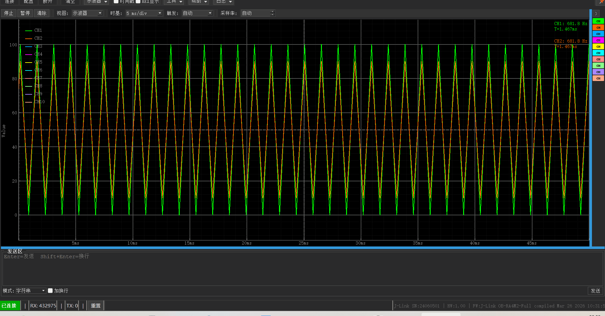

**English | [简体中文](更新说明.md)**
# RTT Assistant - Changelog

## v2.2.0 (Latest)

### New Features

1. **Firmware Flashing**
   - Toolbar flash button for one-click firmware flashing to MCU
   - Supports J-Link (pylink DLL), DAP-Link, ST-Link (pyocd) debuggers
   - Firmware file selection panel in config dialog with multi-path support (open/replace/delete)
   - Real-time flash progress dialog with log output; auto-close on success, stay open on failure
   - Color-coded success/failure labels (green/red background)
   - Bidirectional path linkage between firmware and RTT map files
   - Flash parameters read from config page (debugger type, chip model, speed, interface, etc.)
   - Auto .srec to .elf replacement for pyocd backend
   - Error popup dialogs (file not found, debugger not configured, unsupported format, etc.)

2. **i18n Enhancement**
   - Flash-related UI (toolbar button, config panel, progress dialog) supports language switching
   - 16 new i18n translation keys for flash feature

3. **Config Management Enhancement**
   - Firmware path list persisted to config.json, auto-restored on restart
   - New firmware_paths and active_firmware_index config entries

### Bug Fixes

1. **Oscilloscope Sub-Channel Waveform Display Fix**
   - Root cause: `_parse_channel_jscope()` flat-merged all values from multi-field JScope packets into a single list, causing JScope_u4u4 to show only 1 waveform
   - Fix: SubChannelSplitter with O(N) single-pass parsing and sub-channel splitting, each sub-channel independently emits waveform data
   - Sub-channel naming: CH1[1], CH1[2] (parent channel name + 1-based index)
   - Single sub-channel uses parent channel directly; parent channel disabled when sub-channels >= 2
   - Legend, frequency text, and waveform curves follow check state and order consistently

2. **Frequency Flicker Fix**
   - Root cause: Frequency recalculated from full data on every flush
   - Fix: Sliding window of 500 samples + recalculate only every 10th flush

3. **UnboundLocalError Fix**
   - Root cause: Local import shadowing top-level import of same name
   - Fix: Extract `_resolve_channel_key()` helper method to eliminate local import

4. **Config Persistence Improvements**
   - config.json generated on startup, missing fields auto-completed
   - Reset to default config menu item
   - Window size/maximized state/toolbar position save and restore

## v2.1.5

### Bug Fixes

1. **RTT Log Line Loss (Core Fix)**
   - Root cause: `ch.read(length=1024)` hardcoded truncation; MCU 20 log lines ~1100 bytes exceed 1024B, incomplete read in one call causes log lines truncated at 1024B boundary
   - Fix: pyocd backend prioritizes `ch.read()` no-argument call (native read mode) to read all available data at once, consistent with `pyocd rtt` command behavior; JLink backend uses backlog read loop (repeatedly read until 0 bytes returned)

2. **JLink Backend Log Line Loss**
   - Root cause: pylink `rtt_read` API requires buffer_size parameter, hardcoded 1024B causes same truncation
   - Fix: `pylink_read_size` defaults to 4096 (configurable), backlog read loop as fallback

3. **UI Receive Area Scrollbar Forced to Bottom**
   - Root cause: `moveCursor(QTextCursor.End)` + `insertPlainText()` triggers QTextEdit auto-scroll every time
   - Fix: Use `QTextCursor` to directly manipulate document insertion (no scroll trigger); auto-scroll to bottom only when scrollbar is already at bottom (smart tracking mode)

4. **Ring Buffer Full Warning Flooding**
   - Root cause: `error_occurred.emit()` sends buffer full warning to UI status bar
   - Fix: Downgrade to `_logger.debug()`; ring buffer full does not affect log file and UI display

### New Features

1. **Adaptive Polling Strategy**
   - Fast polling when data is available (fast_interval defaults to 2ms), reduced frequency when idle (slow_interval defaults to 10ms)
   - Multi-channel dynamic calculation: `effective = max(fast_interval, channel_count x swd_latency)`

2. **CH0 Log UI Throttling**
   - 50ms timer batch-merges insertions into QTextEdit, operation frequency reduced from 80 O(n)/sec to 8-12 O(n)/sec, ~7-10x performance improvement
   - Data log file real-time writes are not affected by throttling; only UI display frequency is optimized

3. **Signal Merge Optimization**
   - Multiple CH0 reads within the same polling cycle are merged into a single `data_received` signal emission

4. **Diagnostic Log Management**
   - New "Log Management" entry in log menu, view file size and level of 3 diagnostic logs (rtt_system/pyocd_diag/rtt_debug), with clear operation support

5. **Smart Scroll Tracking**
   - Auto-track latest data when scrollbar is at bottom; stop tracking on manual scroll-up to freely browse history; auto-resume tracking when dragged back to bottom

6. **UI Button Effect Optimization**
   - All buttons add borders in dark/light mode, with press-down feedback effect
   - Disabled states (e.g., grayed-out controls and labels when switching debugger) display more clearly in dark mode: dashed border + dark text

### New Configuration Items

| Configuration Item | Default | Description |
|--------|--------|------|
| `ring_buffer_size` | 65536 | Ring buffer size |
| `ring_buffer_full_log_level` | DEBUG | Buffer full warning level |
| `log_level.rtt_system` | INFO | rtt_system log level |
| `log_level.pyocd_diag` | INFO | pyocd_diag log level |
| `log_level.rtt_debug` | INFO | rtt_debug log level |

## v2.1.2

### Bug Fixes

1. **Pack Auto-Download Failure (Critical Bug After Packaging)**
   - Root cause: subprocess call to `venv/Scripts/python.exe`, the launcher reads the absolute path of the development machine from `pyvenv.cfg`, which does not exist on the user machine, causing `did not find executable`
   - Fix: Pack search changed to in-process import (`cache.index` dict search), Pack download changed to urllib direct download of .pack file to `runtime/packs/`, no subprocess launched at all

2. **Pack Download Reports Success on Network Disconnect**
   - Root cause: `cache.download_pack_list()` silently returns without raising exception when network is disconnected
   - Fix: Verify .pack file actually exists after download, return failure if not found

3. **Pack Download No Progress Display (Large Files e.g. Renesas RA_DFP 91MB)**
   - Fix: Download dialog shows download link (selectable/copyable), file size, 10% granularity progress, and target folder path

4. **Pack Download Failure Without Manual Guidance**
   - Fix: Failure popup prompts manual download and copy to `runtime/packs/` (path is copyable)

5. **Feedback Popup Email Not Copyable, Close Button Ineffective**
   - Fix: Switch to QDialog, email is selectable/copyable, both X and OK buttons can close

6. **Dependency Management Window Lag After Packaging**
   - Root cause: `subprocess.run([venv_python, '--version'])` hangs for 5s due to invalid pyvenv.cfg; `importlib.import_module('pyocd')` importing large package is very slow
   - Fix: Python version obtained directly via `sys.version_info`; package version prioritizes `importlib.metadata.version()` to read metadata

7. **Dependency Management Shows Dependencies Already Packaged in exe**
   - Fix: Remove pylink, pefile, etc., only show upgradable dependencies in venv

8. **venv Unusable After Moving Project to Another Computer**
   - Fix: `fix_pyvenv_cfg()` auto-detects and fixes invalid paths on startup

9. **config.json Hardcoded Development Machine Absolute Path**
   - Fix: `map_file_path` default value changed to null

10. **Build Script Not Copying cpm_cache Index**
    - Fix: build.py copies `runtime/cpm_cache/index.json` to distribution directory

### New Features

1. **Pack Direct Download**
   - Extract .pack download URL from index, download directly to `runtime/packs/` using urllib
   - Download dialog shows copyable download link, supports manual download as alternative

2. **cpm_cache Localization**
   - cmsis_pack_manager cache moved from `%LOCALAPPDATA%` to `runtime/cpm_cache/` (within project directory)
   - Distribute `index.json` during packaging; new computers can search Packs without downloading index

3. **pyvenv.cfg Auto-Fix**
   - Auto-detect and fix invalid paths on startup; no manual modification needed after moving project

4. **Post-Packaging shebang/pyvenv.cfg Fix**
   - build.py auto-fixes venv Scripts shebang and pyvenv.cfg paths

### Performance Optimization

1. **Pack Operations Remove subprocess Overhead**
   - Search: `cache.index` dict search (0ms)
   - Download: urllib direct download (seconds to minutes, depending on file size)
   - Remove `_enumerate_subprocess()`, `_find_pyocd_exe()`, and other no-longer-needed code

2. **Dependency Version Read Optimization**
   - `importlib.metadata.version()` reads metadata instead of importing entire package (100x faster)

---
## v2.1.1

### Bug Fixes

1. **Multi-Channel + Hardware Timestamp Waveform Corruption (Critical Fix)**
   - Root cause: `DataReceiveThread` emits both `data_received` and `batch_received` signals simultaneously, same data processed by both paths (dual-path dispatch), causing timestamp and value duplication
   - Fix: In batch branch, `channel>0` data no longer emits `data_received`, only goes through `batch_received` single path
   - Fix: `_on_batch_received` in high-speed mode directly emits `_hs_bridge.data_ready`, no longer redundantly calls `_on_data_received_dispatch`

2. **JScope Packet Truncation Across RTT Read Boundaries**
   - Root cause: `_parse_channel_jscope` assumes data starts at packet boundary; when RTT returns bytes not a multiple of packet_size, trailing partial packets are lost + next parse misaligned
   - Fix: Add `_residual_buffers` partial packet buffer, concatenate residual bytes before parsing, save trailing residual bytes after parsing

3. **High-Speed Mode Frequency/Period Calculation Error**
   - Root cause: `_decimate_peak` rearranges values into (min,max) pairs, breaking peak detection; multi-channel frequency text positions overlap
   - Fix: Calculate frequency on raw data before decimation, pass via independent signal; each channel frequency text vertically offset by index

4. **Hardware Timestamp Baseline Cross-Channel Shared Offset**
   - Root cause: `_hw_ts_origin` is a single variable shared by all channels, later-processed channels baseline is preempted by earlier-processed channels
   - Fix: Changed to per-channel independent `_hw_ts_origins[channel]` dict

5. **Buffer Data Read Non-Atomic**
   - Root cause: Race window between `list()` copies of two deques in `get_buffer_data()`
   - Fix: Truncate to `min(len(ts), len(vals))` to ensure consistent return length

6. **Crash When Clicking Connect Without Probe**
   - Root cause: JLink DLL native popup triggered in QThread, Win32 message loop conflict causes segfault
   - Fix: Call `disable_dialog_boxes()` after `jlink.open()` to disable DLL popups; throw explicit error when no probe

7. **No Prompt When Quick Connect Without Configured Probe**
   - Fix: When quick connecting without `serial_number` and `ip_address`, immediately prompt user to go to config page to refresh probes, do not enter async connection flow

### MCU Code for Verification Testing

Multi-channel + hardware timestamp testing requires MCU-side to declare channel names in JScope format and send timestamped data packets:


```c
#define RTT_TIMESTAMP 1
#if RTT_TIMESTAMP
    static char buf1[1024];
    SEGGER_RTT_ConfigUpBuffer(1, "JScope_t4u4", buf1, sizeof(buf1), SEGGER_RTT_MODE_NO_BLOCK_SKIP);
    static char buf2[1024];
    SEGGER_RTT_ConfigUpBuffer(2, "JScope_t4u1", buf2, sizeof(buf2), SEGGER_RTT_MODE_NO_BLOCK_SKIP);
#else
    static char buf1[1024];
    SEGGER_RTT_ConfigUpBuffer(1, "JScope_u4", buf1, sizeof(buf1), SEGGER_RTT_MODE_NO_BLOCK_SKIP);
    static char buf2[1024];
    SEGGER_RTT_ConfigUpBuffer(2, "JScope_u1", buf2, sizeof(buf2), SEGGER_RTT_MODE_NO_BLOCK_SKIP);
#endif

volatile uint32_t global_hw_tick = 0;

#pragma pack(push, 1)
typedef struct {
    uint32_t hw_timestamp;
    uint32_t value;
} JScopePacket_u4;

typedef struct {
    uint32_t hw_timestamp;
    uint8_t  value;
} JScopePacket_u1;
#pragma pack(pop)

static volatile uint32_t temp1 = 0;
static volatile uint8_t temp2 = 0;
void g_gpt0CB(timer_callback_args_t *p_args)
{
    if(p_args->event == TIMER_EVENT_CYCLE_END)
    {
#if RTT_TIMESTAMP
        uint32_t now_tick = global_hw_tick;
        JScopePacket_u4 pkt1;
        pkt1.hw_timestamp = now_tick;
        pkt1.value = (temp1 == 100) ? 0 : 100;
        SEGGER_RTT_Write(1, &pkt1, sizeof(pkt1));

        JScopePacket_u1 pkt2;
        pkt2.hw_timestamp = now_tick;
        pkt2.value = (temp2 == 90) ? 10 : 90;
        SEGGER_RTT_Write(2, &pkt2, sizeof(pkt2));

        temp1 = pkt1.value;
        temp2 = pkt2.value;
#else
        temp1 = (temp1 == 100) ? 0 : 100;
        SEGGER_RTT_Write(1, &temp1, 4);
        temp2 = (temp2 == 90) ? 10 : 90;
        SEGGER_RTT_Write(2, &temp2, 1);
#endif
    }
}

void g_gpt1CB(timer_callback_args_t *p_args)
{
    if(p_args->event == TIMER_EVENT_CYCLE_END)
    {
        global_hw_tick++;
    }
}
```

---
## v2.1.0

### Bug Fixes

- J-Link reconnection failure after disconnect (disconnect did not clear wrapper)
- JLinkRTTWrapper did not forcefully clean up residual resources on disconnect

### New Features

- **New Theme Feature**: Support dark and light mode switching
- **Oscilloscope Mode**
  - **Data Format J-Scope Standard**: Auto-identify 7 fixed formats (int8/uint8/int16/uint16/int32/uint32/float)
  - **Acquisition Control**: Start/Stop/Pause/Resume acquisition; auto-stop acquisition on device disconnect
  - **High-Speed Mode Auto-Switch**: <2000 samples/s uses normal mode (main thread processing), >5000 samples/s auto-switches to high-speed mode (independent QThread + 30FPS decimation)
- New version check feature, auto or guided download of new version

### Performance/Feature Optimization

1. **Phased Loading Startup**
   - Phase 1: Window-related initialization (config loading / UI creation / theme application), window displays immediately
   - Phase 2: Backend initialization (PyOCD / J-Link import etc. deferred to event loop execution)
   - Window display speed optimized from ~1200ms to ~450ms
   - No more white screen on first click, status bar provides real-time loading progress feedback

2. **Remove QThread.terminate()**
   - No longer forcefully terminate thread on connection timeout
   - Use cooperative exit: set abort flag + disconnect() to let connection fail naturally
   - Avoid J-Link DLL state corruption and USB handle leaks

3. **Ring Buffer Full Alert**
   - DataReceiveThread RingBuffer no longer silently discards when full
   - Alert via error_occurred signal (includes discarded byte count and channel number), with anti-flooding logic

4. **Error Log Correction**
   - J-Link backend no longer prints misleading `pyocd rtt` command line on connection
   - Changed to output correct `JLinkRTTLogger -Device ... -Interface SWD -Speed ...`

5. **UI Optimization**
   - Optimized send area width, position, and send newline hint
   - Optimized send/receive counter reset button position
   - Optimized custom button position
   - Optimized font modification save
   - Optimized status bar connection status indicator color

### Packaging Optimization

- pyqtgraph + numpy packaged into exe, oscilloscope works out of the box
- Remove PyQt5(142MB) / pyqtgraph(7MB) / numpy(30MB) from venv, reducing distribution size by ~179MB
- Dependency declaration alignment: PyQt5 / pyqtgraph / numpy are packaged into exe, no longer need system installation

---
## v2.0.0

### Architecture Restructuring

1. **Runtime Directory Separation**
   - All runtime files migrated from exe sibling directory to `runtime/` subdirectory
   - `runtime/dll/`: JLink_x64.dll, libusb-1.0.dll
   - `runtime/packs/`: CMSIS Pack files
   - `runtime/venv/`: Python virtual environment (PyOCD and dependencies)
   - Config files migrated to `config/` directory
   - exe is fully independent, does not pollute user directory

2. **Independent Python Virtual Environment**
   - PyOCD and all dependencies installed in `runtime/venv/`
   - Does not depend on system Python environment
   - First-time use can install dependencies via "Help -> Dependency Management"

### New Features

1. **ST-Link Connection Support**
   - Verified ST-Link RTT communication using NUCLEO-U575ZI-Q
   - Verified DAP-Link RTT communication using RT-Thread Titan Board
   - Verified J-Link OB RTT communication using EK-RA8P1


<div style="display: flex; gap: 5%; justify-content: center; align-items: center; width: 100%;">
    
    
    
</div>

### Performance Optimization

- Log rotation: rtt_system.log and pyocd_diag.log use RotatingFileHandler (5MB rotation)
- PyOCD target index: first load from pyocd_targets.txt (millisecond-level), async refresh in background
- Build packaging: build.py auto-terminates processes occupying exe, venv copy integrity verification

### Packaging Improvements

- exe naming prefix RTT- (RTT-Assistant v2.0.0.exe)
- build.py: clear dist before packaging, auto taskkill when exe is occupied, venv copy critical package verification + retry
- RTT-Assistant.spec: excludes usb/usb1/pyocd/hid, runtime_hook uses meta path finder hack bypass

---
## v1.5.0

### New Features

1. **PyOCD Backend Support (DAP-Link/ST-Link)**
   - New PyOCD debugger backend, supports DAP-Link, ST-Link and other CMSIS-DAP probes
   - Use RTT functionality without J-Link hardware
   - Auto-detect connected CMSIS-DAP probes
   - Support loading target chip definitions from CMSIS Pack

2. **CMSIS Pack Management**
   - Support auto-loading `.pack` files from local `packs/` directory
   - Users can download Packs and place them in `packs/` directory, click "Update" button to refresh
   - `pyocd.yaml` config file auto-sync: auto-generate based on actual Pack files during refresh/connect
   - PyOCD target list cached to `pyocd_targets.txt`, speeding up subsequent loads

3. **Configuration Dialog Step-by-Step**
   - Config interface redesigned into 5 clear steps:
     - Step 1: Debugger selection (probe list + refresh)
     - Step 2: Connection method (USB/TCP/IP)
     - Step 3: Target device (J-Link/other Link device selection)
     - Step 4: Interface settings (SWD/JTAG, speed, connection mode)
     - Step 5: RTT control block (search method, Map file, etc.)
   - Each step grouped with QGroupBox, bold title + border + number, visually clear

4. **Probe Type Linkage**
   - When selecting DAP-Link/ST-Link, "Get Auto-Detect Address" button is auto-disabled (this feature depends on J-Link device database)
   - Map file search and "Search _SEGGER_RTT" button are universal for all probes, not affected
   - UI control state real-time linkage when switching probes

5. **Package PyOCD Integration**
   - PyOCD and all its dependencies (usb1, intelhex, pyelftools, etc.) fully packaged into exe
   - No need to install Python after packaging to use DAP-Link/ST-Link connection
   - `packs/`, `pyocd.yaml`, `pyocd_targets.txt` auto-copied to exe sibling directory

### Performance Optimization

- **Config Dialog Lazy Loading**: Device list (14180 items) and PyOCD target list deferred to async loading after dialog display, dialog open speed optimized from ~300ms to ~10ms
- **PyOCD Target Cache**: Prioritize reading from `pyocd_targets.txt`, avoid `import pyocd` overhead each time

### Bug Fixes

- Fixed PyOCD target loading failure from Pack: `[WinError 2] The system cannot find the specified file`
  - Cause: `connection_dialog.py` hardcoded `subprocess.run(['pyocd', ...])`, pyocd not in PATH on new computer
  - Fix: Prioritize Python API loading, fallback to `_find_pyocd_exe()` to find pyocd executable

---
## v1.4.2

### New Features

1. **RTT Control Block Search Range Auto-Fill**
   - New "Get Auto-Detect Address" button after "Config - RTT Control Block - Search Range"
   - Click to auto-read current device RAMAddr and ram_size from devices.txt
   - Auto-fill search range start address and size input boxes
   - No need to manually query device RAM information

2. **Map File Symbol Search**
   - New "Map File Search" group box under "Config - RTT Control Block"
   - **Open map file**: Select map file path, auto-save to config
   - **Search _SEGGER_RTT**: Parse map file, auto-extract RTT control block address and fill into manual address box
   - Support GCC, IAR, Keil, GNU and other compiler-generated map file formats
   - Multi-encoding support (UTF-8, GBK, Latin-1)

3. **Auto-Update RTT Address on Connect**
   - When "Manual Address" mode is selected and map file path is configured
   - Each click of "Connect" button re-searches for latest RTT address from map file
   - Auto-update to config and save, no manual refresh needed
   - Auto-adapts when RTT address changes after MCU recompilation

4. **DEBUG Log Level**
   - New DEBUG level filter option in system log
   - Performance trace logs use DEBUG level (displayed in gray)
   - Can filter and view performance analysis info in log window

### Performance Optimization

- **DeviceInfoService Global Reuse**: Avoid re-parsing 1.9M devices.txt file each time config dialog is opened
- Config button response time optimized from ~3s to ~100ms

### UI Improvements

- "Auto" button renamed to "Get Auto-Detect Address"
- Map file search function enclosed in GroupBox for clearer interface
- "Open" button renamed to "Open map file"
- "Search" button renamed to "Search _SEGGER_RTT"


---

## v1.4.1

### New Features

1. **Device Full Info Read and Persistence**
   - On config-update, read all attributes of each device from JLink DLL (name, manufacturer, Core, FlashSize, RAMSize, CoreId, FlashAddr, RAMAddr, etc.), no longer just device name
   - Directly call DLL JLINKARM_DEVICE_GetInfo interface via ctypes, no need to connect J-Link hardware probe
   - devices.txt upgraded to v2 structured format (`name|attr1=val1|attr2=val2|...`), backward compatible with v1 format
   - Address-type fields (FlashAddr, RAMAddr, CoreId) stored in hex format for readability

2. **Device Info Log Print on Connect**
   - On device connect, write all device info with `[Device Info]` tag to rtt_system.log system log
   - Log format: `[Device Info] name=STM32F407 | family=ST | core=0x0E0000FF | flash_size=1049104 | ...`
   - When device info unavailable, mark "Full info unavailable"; print failure does not block connection flow

3. **Unified Version Number Management**
   - Version number unified in `rtt_tool/__init__.py` `__version__` variable
   - All code and build scripts reference this variable; version upgrade only needs one change

### Technical Changes

| Change Item | v1.4 | v1.4.1 |
|--------|------|--------|
| Device info read | Name only | All DLL attributes |
| devices.txt format | v1 (name only) | v2 (structured key-value pairs) |
| DLL call method | jlink.open()+supported_device() | ctypes direct call JLINKARM_DEVICE_GetInfo |
| Connection log | No device info | [Device Info] full attribute log |
| Version management | Multiple hardcoded | __version__ unified |

---
## v1.4

### New Features

1. **ANSI Escape Code Coloring**
   - Receive area supports parsing ANSI escape codes defined by SEGGER RTT (e.g., `\x1B[2;31m` red)
   - Disabled by default, enable via Tools menu -> ANSI Coloring toggle
   - Compatible with RTT_CTRL_TEXT_RED and other color macros defined in SEGGER RTT source code

2. **Keyword Highlighting**
   - Receive area supports keyword match highlighting
   - Built-in rules: ERROR/WARN/WARNING (yellow)/FAIL (red), OK/SUCCESS (green), INFO (blue)
   - Support custom keyword and color configuration
   - Enabled by default, manage via Tools menu -> Keyword Highlighting submenu

3. **Tools Menu**
   - New Tools menu, includes: Font Settings, ANSI Coloring toggle, Keyword Highlighting submenu
   - Keyword Highlighting submenu includes enable toggle and rule config dialog

4. **RTT Search Log Enhancement**
   - Auto-log memory zones info on connect (display J-Link accessible AP paths)
   - Log Up/Down buffer count and size after RTT init (100ms delay to ensure accurate state)
   - Provide SEGGER knowledge base hyperlink tip on address and range mode connection failure

5. **RTT Range Search Mode**
   - Support custom RTT control block range search (start address + size), consistent with SEGGER RTT Viewer
   - Log during search process for diagnosing RTT control block location issues on multi-AP chips (e.g., Renesas RZ series)

6. **Device List Update from DLL**
   - New "Update" button in connection dialog, can read all supported device list from J-Link DLL
   - Update results saved to devices.txt, auto-loaded on next startup

7. **J-Link DLL Version Info Display**
   - About page shows J-Link DLL version number and supported device count
   - Status bar shows J-Link serial number, hardware version, firmware version after connection

### Improvements

1. **External File Separation**
   - config.json, JLink_x64.dll, devices.txt no longer packaged inside exe
   - These 3 files placed in same directory as exe, convenient for users to modify config and replace DLL
   - Auto-generate config.json in exe directory on first run

2. **Config Persistence Enhancement**
   - New config items: ansi_color_enabled, keyword_highlight_enabled, keyword_rules
   - All Tools menu toggle states auto-saved to config.json, restored after restart

3. **Remove "Skip Reset" Feature**
   - This feature was not effective in practice; related code and UI removed

4. **DLL Search Priority Adjustment**
   - After packaging, prioritize searching for JLink_x64.dll from exe directory, then current directory, then J-Link install directory

### Technical Changes

| Change Item | Old Version | New Version |
|--------|--------|--------|
| Version | v1.3.1 | v1.4 |
| External files | Packaged in exe | Placed alongside exe |
| ANSI coloring | Not supported | Supported (disabled by default) |
| Keyword highlighting | Not supported | Supported (enabled by default) |
| RTT search log | None | memory zones + buffer info |
| Range search | None (auto/address only) | Supported (start address + size) |
| Device list | Hardcoded | Updatable from DLL to devices.txt |
| Skip reset | Supported | Removed |

---
## v1.3.1

### Bug Fixes

1. **exe Standalone Running Issue**
   - Repackaged with Python 3.13
   - Fixed inability to run on new computers
   - No longer depends on local Python environment

2. **JLink DLL Bitness Matching**
   - Auto-detect DLL bitness matches Python bitness
   - 64-bit Python uses JLink_x64.dll
   - Clear error message for bitness mismatch

3. **PyInstaller Packaging Optimization**
   - Use --onefile mode packaging
   - Hide terminal window (console=False)
   - Auto-include all dependencies (PyQt5, pylink, etc.)

### Improvements

1. **Program Name**
   - exe name changed to: Segger-RTT-Assistant v1.3
   - Version number updated to v1.3

2. **Icon**
   - Updated exe icon

3. **Cross-Platform Compatibility**
   - exe can run on any Windows computer
   - No need to install Python, PyQt5, pylink and other dependencies
   - Complete standalone packaging

### Technical Changes

| Change Item | Old Version | New Version |
|--------|--------|--------|
| Python version | 3.10.0 | 3.13 |
| Version | v1.2 | v1.3.1 |
| Packaging mode | onedir | onefile |
| Terminal window | Visible | Hidden |
| Standalone running | Requires Python | Not required |

---
## v1.2

### Major New Features

1. **Log Window**
   - New independent log window, displays connection, communication, and error logs
   - Support log type filtering (All/INFO/WARNING/ERROR/SUCCESS)
   - Different log types displayed in different colors
   - Support clear log function
   - New "Log" button in toolbar, can open/close log window at any time

2. **Renesas Device Model Support**
   - Device model list added: R9A07G084M04
   - Support Renesas series MCU

3. **RTT Control Block Address Auto-Save**
   - Auto-save after manually entering RTT control block address
   - Auto-fill previous address when opening connection dialog next time
   - New rtt_address field in config file

### Feature Details

| Feature | Description |
|------|------|
| Log window | Display connection, communication, error logs |
| Log types | INFO/WARNING/ERROR/SUCCESS |
| Log colors | Green/Yellow/Red/Cyan |
| Log filtering | Support filtering by type |
| Renesas device | R9A07G084M04 |
| RTT address save | Auto-save and fill |

### Technical Improvements

1. **New LogService** (log_service.py)
   - Log recording and management service
   - Support multiple log types
   - Max 1000 log entries saved

2. **New LogWindow** (log_window.py)
   - Independent log display window
   - Support log filtering and clearing
   - Display different types in different colors

3. **Updated ConnectionService**
   - Integrated log service
   - Detailed logging during connection process
   - Error info recorded to log

4. **Updated ConfigService**
   - New rtt_address config item
   - Support RTT address persistence

5. **Updated ConnectionDialog**
   - Support RTT address auto-fill
   - Added Renesas device model

### Usage

1. **View Logs**
   - Click "Log" button in toolbar
   - Log window displays all operation logs
   - Can filter logs by type

2. **Connect Renesas Device**
   - Click "Connect" button
   - Select or enter in device model: R9A07G084M04
   - Configure other parameters and connect

3. **Use RTT Address Save**
   - Select "Address" mode
   - Enter RTT control block address (e.g., 0x20000000)
   - Auto-fill this address on next connection

---
## v1.1

### Major Fixes

1. **Fixed DLL Loading Issue**
   - Use pylink-square library instead of direct DLL calls
   - Auto-find JLinkARM.dll (supports multiple paths)
   - Support DLL in current directory

2. **New Connection Configuration Dialog**
   - Fully replicates JLinkRTTViewer connection interface
   - Support USB/TCP/IP connection methods
   - Support serial number/IP address specification
   - Support device model selection
   - Support interface type and speed settings
   - Support RTT control block address configuration (auto-detect/specify address/search range)

3. **Integrated pylink Library**
   - Use pylink-square library (more stable)
   - Support all JLink features
   - Better error handling

### Connection Dialog Features

| Feature | Description |
|------|------|
| Connection method | USB / TCP/IP |
| Device identification | Serial number or nickname |
| Target device | Support multiple MCU models |
| Interface type | SWD / JTAG |
| Interface speed | 1000-20000 kHz |
| RTT control block | Auto-detect / Specify address / Search range |

### Usage

1. **Start Program**
   ```bash
   python main.py
   ```
   Or run the packaged exe:
   ```bash
   dist/RTT-Tool.exe
   ```

2. **Connect MCU**
   - Click "Connect" button
   - Configure connection parameters in the popup dialog
   - Click "OK" to start connection

3. **Configuration Instructions**
   - **Connection method**: Select USB or TCP/IP
   - **Device model**: Select or enter MCU model (e.g., Cortex-M4)
   - **Interface**: Select SWD or JTAG
   - **Speed**: Select interface speed (recommended 4000 kHz)
   - **RTT control block**:
     - Auto-detect: Let JLink auto-find RTT control block
     - Address: Manually specify RTT control block address (e.g., 0x20000000)
     - Search range: Specify search range

### Dependency Updates

requirements.txt updated:
```
PyQt5>=5.15.0
pyinstaller>=5.0.0
pylink-square>=2.0.0
psutil>=5.2.2
```

### Technical Improvements

1. **JLink RTT Wrapper** (jlink_rtt_wrapper.py)
   - Use pylink.JLink class
   - Support serial number and IP address connection
   - Support RTT address specification
   - Better exception handling

2. **Connection Service** (connection_service.py)
   - Support config dict parameters
   - Support RTT address configuration

3. **Main Window** (main_window.py)
   - Integrated connection dialog
   - Signal changed to pass config dict

4. **Connection Dialog** (connection_dialog.py)
   - Complete connection configuration interface
   - Support all JLinkRTTViewer config items

### Notes

1. **JLink Software**
   - Requires JLink software installed (V930+)
   - Program will auto-find JLinkARM.dll

2. **MCU Requirements**
   - MCU needs RTT code ported
   - RTT needs to be initialized

3. **pylink Library**
   - pylink-square auto-installed
   - No manual configuration needed

### Comparison with Original Version

| Feature | Original | New |
|------|------|------|
| DLL loading | Direct call | pylink library |
| Connection dialog | No | Yes |
| Device selection | Fixed | Selectable |
| RTT address | Auto | Configurable |
| Connection method | USB | USB/TCP/IP |
| Serial number | No | Yes |
| Log window | No | Yes |
| Renesas device | No | Yes |
| RTT address save | No | Yes |
