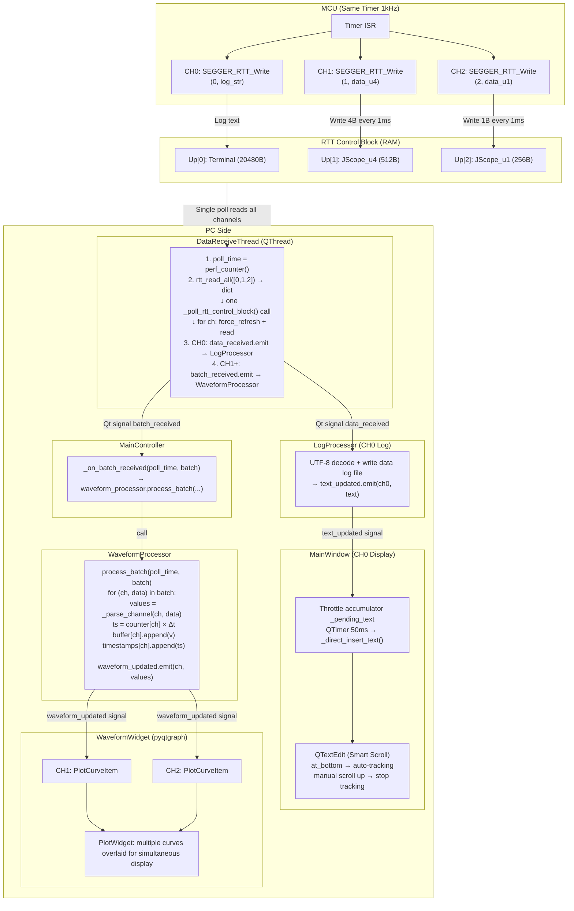
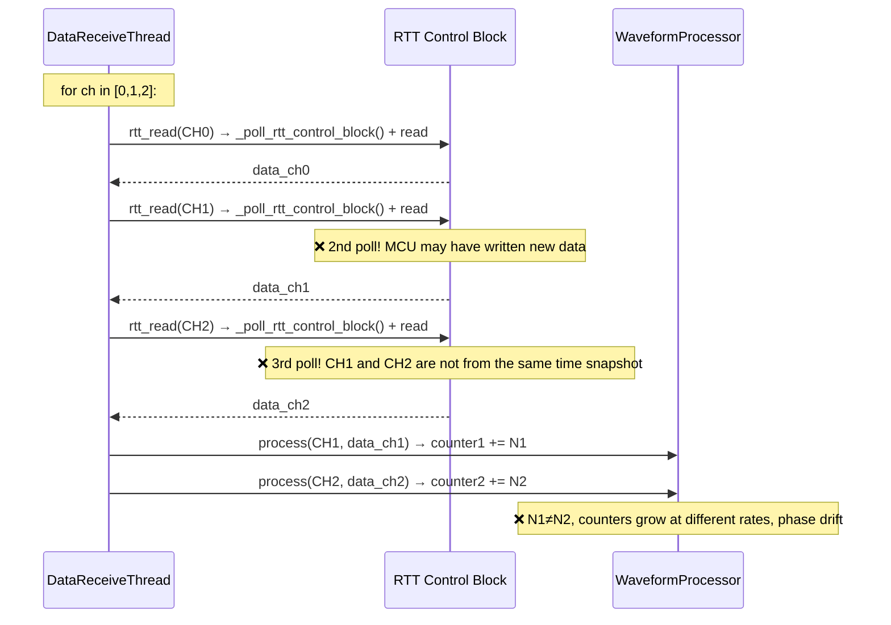
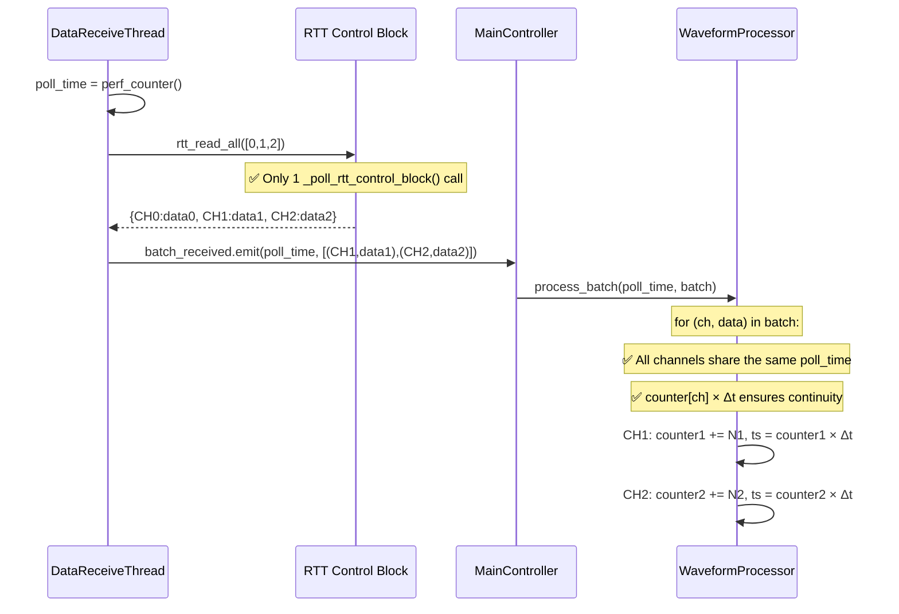
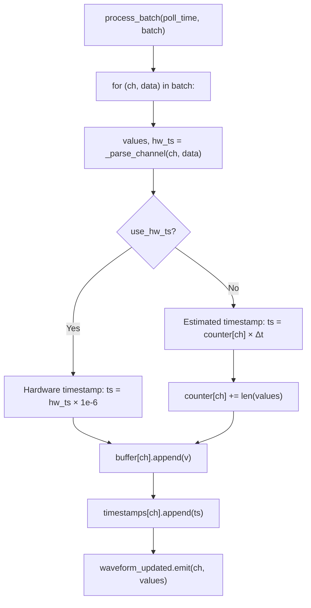
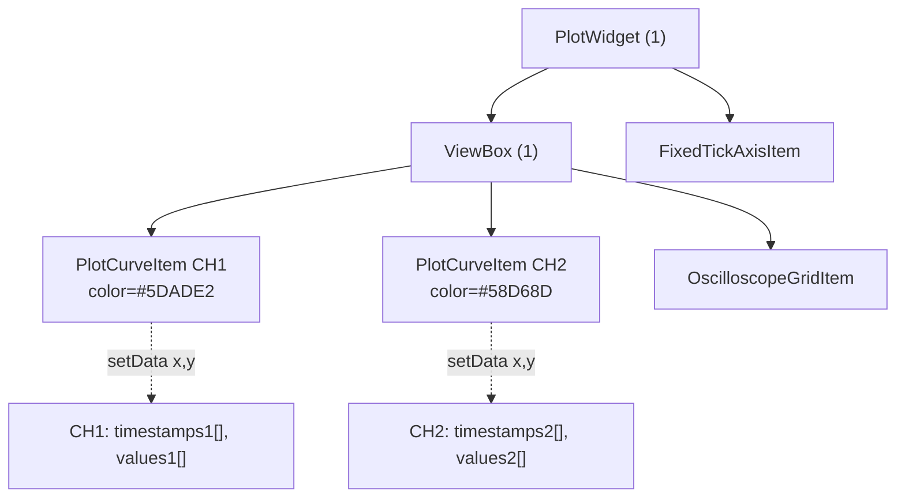

**English | [简体中文](数据接收与多通道显示流程.md)**
# RTT-Assistant Data Reception and Multi-Channel Display Flow

## Overall Architecture Diagram



## v2.1.5 Key Improvements

### 1. RTT Read Integrity: pyocd Native Read Mode

**Problem**: Previously `ch.read(length=1024)` was hardcoded with truncation. MCU 20 log lines ≈ 1100 bytes, a single read could not finish, causing log line loss.

**Fix**: Prefer `ch.read()` with no arguments (consistent with `pyocd rtt` command behavior), reading all available data in one call. Only fall back to `ch.read(length=20480)` when the pyocd version does not support parameterless reads.

### 2. JLink Backlog Read Loop

JLink/pylink's `rtt_read` API requires a `pylink_read_size` parameter and cannot be called without arguments. Changed to repeatedly read within a single poll cycle until 0 bytes are returned (backlog drain). `pylink_read_size` defaults to 4096 (configurable).

### 3. Adaptive Polling Strategy

| State | Poll Interval | Description |
|------|----------|------|
| Has data | fast_interval (default 2ms) | Fast tracking of MCU output |
| 3 consecutive empty reads | slow_interval (default 10ms) | Reduce frequency to lower SWD overhead |

Multi-channel dynamic calculation: `effective = max(fast_interval, channel_count × swd_latency)`

### 4. CH0 Log UI Throttling

| | Before Throttling | After Throttling |
|--|--------|--------|
| Operation frequency | 20 lines/sec × 4 O(n) ops = 80 ops/sec | 2-3 ops/sec × 4 O(n) ops = 8-12 ops/sec |
| Latency | 0ms | ≤50ms (imperceptible to human eye) |
| Data loss | None | None (append-style accumulation) |

Data log file is written **in real time** and is not affected by throttling. Throttling only optimizes the QTextEdit display frequency.

### 5. Smart Scroll Tracking

| Scrollbar Position | Behavior |
|------------|------|
| At bottom | New data auto-scrolls to bottom (tracking mode) |
| Manual scroll up | Stops auto-scroll, free to browse history |
| Scrolled back to bottom | Automatically resumes tracking mode |

### 6. Signal Consolidation Optimization

Multiple CH0 reads within the same poll cycle are consolidated into a single `data_received` signal emission, reducing signal count.

### 7. Diagnostic Log Management

A “Log Management” entry is added to the main window log menu, allowing users to view file size and log level for the 3 diagnostic logs, with support for clear operations.

### 8. Ring Buffer Full Warning Downgrade

Buffer full warnings are downgraded from UI status bar to DEBUG log level, avoiding screen clutter.

## Key Improvement: Single-Poll Batch Read

### Before (Buggy)



### Now (Fixed)



## Timestamp Generation Logic



### Why counter[ch] × Δt instead of wall clock?

| Approach | Continuity | Multi-Channel Alignment | Complexity |
|------|--------|-----------|--------|
| counter[ch] × Δt | ✅ Strictly monotonically increasing | ✅ Single poll guarantees same-time snapshot | Low |
| wall clock (perf_counter) | ❌ Poll interval jitter causes gaps/overlaps | ✅ | High |
| Global counter | ✅ Strictly increasing | ❌ CH1 and CH2 interleave counting | Low |

**Chosen: counter[ch] × Δt**:
- Per-channel independent counter ensures timeline continuity (no gaps)
- `rtt_read_all` single poll guarantees CH1/CH2 data is from the same time snapshot
- Independent counters growing at different rates is no longer a problem, because data from all channels within the same poll is processed simultaneously

## Data Flow Key Timestamp Logs

```
[DRT batch] #1 poll=12345.6789 CH1:124B, CH2:31B     ← DataReceiveThread: rtt_read_all complete, emit batch
[batch] #1 poll_offset=0.0000s est_dt=1.00ms ...       ← WaveformProcessor: process_batch start
[batch] #2 poll_offset=0.0105s est_dt=1.00ms ...       ← Next batch, ~10ms later
[flush] #1 ch_count=2 elapsed=0.8ms                     ← WaveformWidget: setData to pyqtgraph
```

### Log Locations

| Stage | File | Log Prefix | Content |
|------|------|---------|------|
| RTT batch read | `data_receive_service.py` | `[DRT batch]` | poll time, channel:bytes |
| Batch processing | `waveform_processor.py` | `[batch]` | poll_offset, est_dt, elapsed, buffer length |
| Render to graph | `waveform_widget.py` | `[flush]` | channel count, elapsed |

## pyqtgraph Multi-Channel Implementation



Each channel has an independent `PlotCurveItem`, each calling `setData(timestamps, values)` independently. Multiple curves are overlaid in the same ViewBox and rendered simultaneously. This is natively supported by pyqtgraph with no special handling required.

## Configuration Reference

| Configuration Item | Default | Description |
|--------|--------|------|
| `ring_buffer_size` | 65536 | Ring buffer size (bytes) |
| `ring_buffer_full_log_level` | DEBUG | Buffer full warning level |
| `log_level.rtt_system` | INFO | rtt_system log level |
| `log_level.pyocd_diag` | INFO | pyocd_diag log level |
| `log_level.rtt_debug` | INFO | rtt_debug log level |
