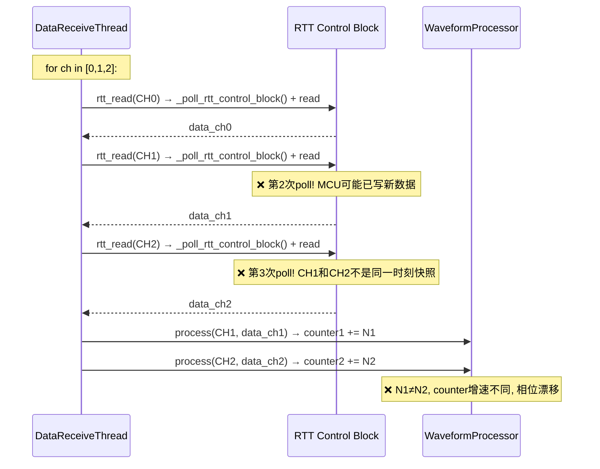
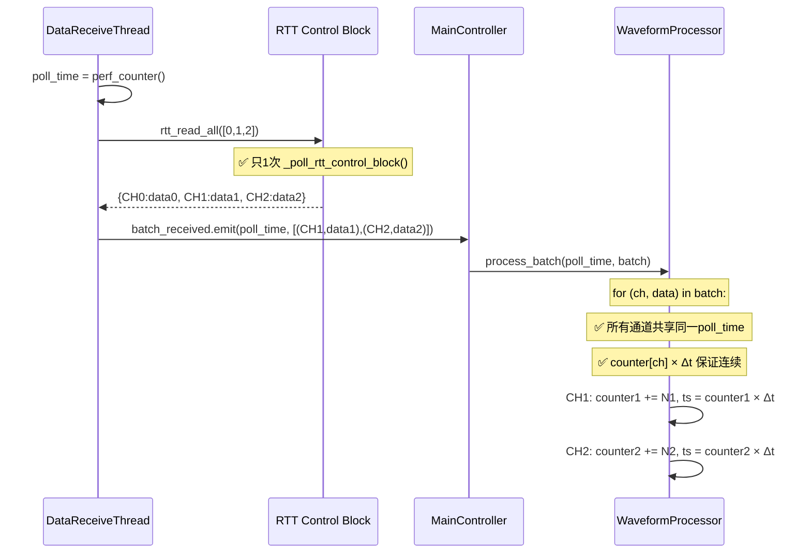
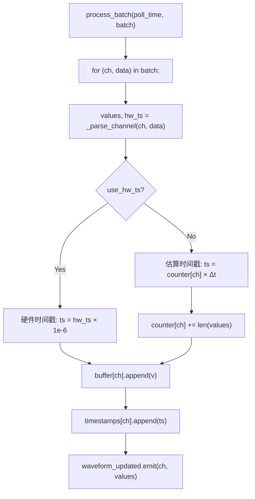
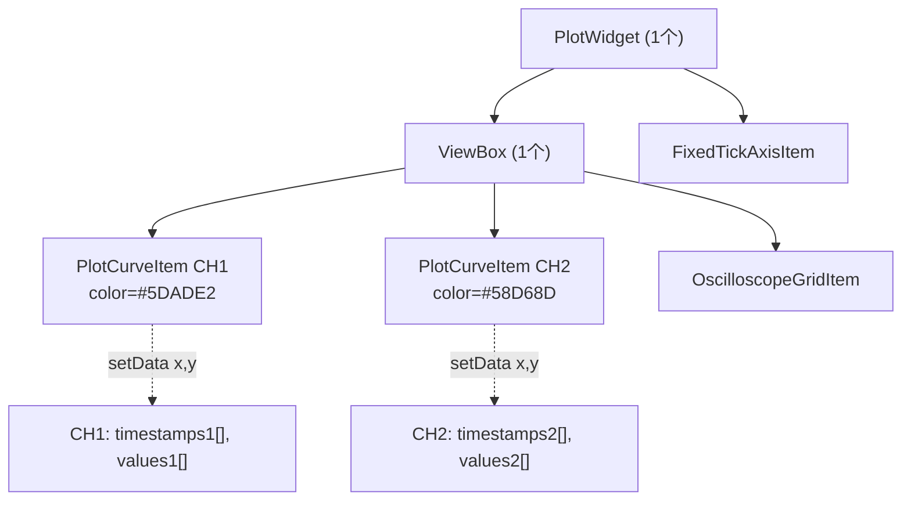

# RTT-Assistant 数据接收与多通道显示流程

## 整体架构框图

```mermaid
flowchart TB
    subgraph MCU["MCU (同一定时器 1kHz)"]
        ISR["Timer ISR"]
        WR1["CH1: SEGGER_RTT_Write<br/>(1, data_u4)"]
        WR2["CH2: SEGGER_RTT_Write<br/>(2, data_u1)"]
        ISR --> WR1
        ISR --> WR2
    end

    subgraph RTTCB["RTT Control Block (RAM)"]
        UP0["Up[0]: Terminal"]
        UP1["Up[1]: JScope_u4 (512B)"]
        UP2["Up[2]: JScope_u1 (256B)"]
    end

    WR1 -->|每1ms写4B| UP1
    WR2 -->|每1ms写1B| UP2

    subgraph PC["PC端"]
        subgraph DRT["DataReceiveThread (QThread)"]
            POLL["1. poll_time = perf_counter()<br/>2. rtt_read_all([0,1,2]) → dict<br/>   ↓ 一次 _poll_rtt_control_block()<br/>   ↓ for ch: force_refresh + read<br/>3. batch_received.emit(poll_time, batch)"]
        end

        subgraph MC["MainController"]
            BATCH["_on_batch_received(poll_time, batch)<br/>→ waveform_processor.process_batch(...)"]
        end

        subgraph WP["WaveformProcessor"]
            PB["process_batch(poll_time, batch)<br/>for (ch, data) in batch:<br/>  values = _parse_channel(ch, data)<br/>  ts = counter[ch] × Δt<br/>  buffer[ch].append(v)<br/>  timestamps[ch].append(ts)<br/>  waveform_updated.emit(ch, values)"]
        end

        subgraph WW["WaveformWidget (pyqtgraph)"]
            CURVE1["CH1: PlotCurveItem"]
            CURVE2["CH2: PlotCurveItem"]
            PLOT["PlotWidget: 多curve叠加同时显示"]
            CURVE1 --> PLOT
            CURVE2 --> PLOT
        end
    end

    RTTCB -->|一次poll读取所有通道| POLL
    POLL -->|Qt signal<br/>batch_received(float, list)| BATCH
    BATCH -->|调用| PB
    PB -->|waveform_updated signal| CURVE1
    PB -->|waveform_updated signal| CURVE2
```

## 关键改进：一次poll批量读取

### 之前（有bug）



### 现在（已修复）



## 时间戳生成逻辑



### 为什么用 counter[ch] × Δt 而不是 wall clock？

| 方案 | 连续性 | 多通道对齐 | 复杂度 |
|------|--------|-----------|--------|
| counter[ch] × Δt | ✅ 严格单调递增 | ✅ 一次poll保证同时刻 | 低 |
| wall clock (perf_counter) | ❌ poll间隔抖动导致间隙/重叠 | ✅ | 高 |
| 全局counter | ✅ 严格递增 | ❌ CH1和CH2交错计数 | 低 |

**选择 counter[ch] × Δt**：
- 每通道独立counter保证时间轴连续（无间隙）
- `rtt_read_all` 一次poll保证CH1/CH2数据是同一时刻快照
- 独立counter增速不同不再是问题，因为同一poll中各通道数据被同时处理

## 数据流关键时间点日志

```
[DRT batch] #1 poll=12345.6789 CH1:124B, CH2:31B     ← DataReceiveThread: rtt_read_all完成, emit batch
[batch] #1 poll_offset=0.0000s est_dt=1.00ms ...       ← WaveformProcessor: process_batch开始
[batch] #2 poll_offset=0.0105s est_dt=1.00ms ...       ← 下一批, ~10ms后
[flush] #1 ch_count=2 elapsed=0.8ms                     ← WaveformWidget: setData到pyqtgraph
```

### 日志位置

| 阶段 | 文件 | 日志前缀 | 内容 |
|------|------|---------|------|
| RTT批量读取 | `data_receive_service.py` | `[DRT batch]` | poll时刻, 通道:字节数 |
| 批量处理 | `waveform_processor.py` | `[batch]` | poll_offset, est_dt, 耗时, buffer长度 |
| 渲染到graph | `waveform_widget.py` | `[flush]` | 通道数, 耗时 |

## pyqtgraph多通道实现



每个通道独立 `PlotCurveItem`，各自 `setData(timestamps, values)`，多条curve叠加在同一个ViewBox同时渲染。pyqtgraph原生支持，无需特殊处理。
